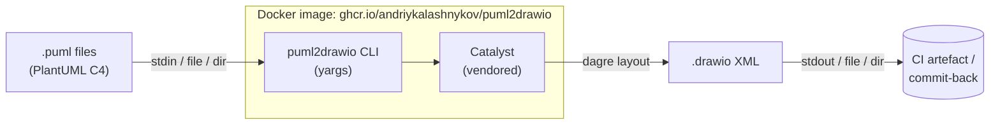

[](https://github.com/andriykalashnykov/puml2drawio/actions/workflows/ci.yml)
[](https://hits.sh/github.com/andriykalashnykov/puml2drawio/)
[](https://opensource.org/licenses/MIT)
[](https://app.renovatebot.com/dashboard#github/andriykalashnykov/puml2drawio)

# puml2drawio

Dockerized CLI that converts PlantUML C4 diagrams (`.puml`) to draw.io XML (`.drawio`). Designed to drop into CI pipelines that commit PlantUML sources and want draw.io output rendered or committed back downstream. Wraps the [localgod/catalyst](https://github.com/localgod/catalyst) JavaScript library — currently pinned to a fork ([AndriyKalashnykov/catalyst](https://github.com/AndriyKalashnykov/catalyst)) that carries unmerged upstream fixes (`localgod/catalyst#552`, `#553`, `#555`–`#558`); Renovate tracks the fork's `main`. Flips back to upstream once those PRs merge.


```mermaid
flowchart LR
  puml[".puml files<br/>(PlantUML C4)"] -->|stdin / file / dir| cli["puml2drawio CLI<br/>(yargs)"]
  cli --> conv["Catalyst<br/>(vendored)"]
  conv -->|dagre layout| drawio[".drawio XML"]
  drawio -->|stdout / file / dir| out[("CI artefact /<br/>commit-back")]

  subgraph "Docker image: ghcr.io/andriykalashnykov/puml2drawio"
    cli
    conv
  end
```

Data-flow view of a conversion: PlantUML source enters via stdin, a file path, or a directory; the CLI delegates layout + XML emission to the vendored catalyst library; draw.io XML leaves via stdout, a file, or a mirrored output directory. The CLI and catalyst both live inside the published Docker image — consumers bind-mount their workspace at `/work`.

| Component | Technology | Rationale |
|-----------|------------|-----------|
| Language | Node.js 24 (ES modules) | catalyst is JS — same runtime keeps the wrapper a thin shim, no FFI |
| CLI parser | yargs | layered flags + env-var precedence + auto help/version |
| Conversion engine | [localgod/catalyst](https://github.com/localgod/catalyst) (vendored at pinned SHA, currently a fork carrying upstream PRs) | only mature OSS PlantUML-C4 → drawio renderer; pinning by SHA isolates the wrapper from upstream breakage |
| Layout engine | [elkjs](https://github.com/kieler/elkjs) (post-processor) | dense container diagrams need more than catalyst's built-in dagre — ELK's `layered` algorithm handles nested boundaries |
| Container base | `node:24-alpine` (non-root `app` user, npm/npx/corepack/yarn stripped) | minimal attack surface; stripped tools eliminate HIGH CVEs in their bundled `minimatch`/`tar` |
| Registry | GitHub Container Registry (GHCR), multi-arch `linux/amd64` + `linux/arm64` | free for OSS, native OIDC for cosign |
| Static analysis | [hadolint](https://github.com/hadolint/hadolint) (Dockerfile) + [shellcheck](https://www.shellcheck.net/) (scripts) | catches Dockerfile + shell anti-patterns in `make static-check` |
| CVE scans | [Trivy](https://trivy.dev/) — filesystem (`trivy fs`) + image (`aquasecurity/trivy-action`) | CRITICAL/HIGH blocking; image scan runs before multi-arch publish |
| Diagram lint | [`minlag/mermaid-cli`](https://github.com/mermaid-js/mermaid-cli) (Docker) | validates README + CLAUDE.md Mermaid blocks render before commit; broken diagrams silently break GitHub homepage rendering |
| Signing | [cosign](https://docs.sigstore.dev/cosign/overview/) keyless OIDC on tag pushes | supply-chain signature without long-lived keys; replaces buildkit in-manifest attestations (which break GHCR's "OS / Arch" tab) |
| Tests | [Vitest](https://vitest.dev/) (unit + integration) + Docker e2e + shell-driven Action shim test | three-layer pyramid; 80% v8 coverage threshold |
| Local CI runner | [act](https://github.com/nektos/act) (`make ci-run`) | exercise the workflow against the local checkout before push; pinned via mise |
| Version manager | [mise](https://mise.jdx.dev/) — `.mise.toml` single source of truth; [`jdx/mise-action`](https://github.com/jdx/mise-action) in CI for tool parity | one declaration, two runners (local + GitHub); avoids per-tool installers and PATH-drift bugs |

## Quick Start

The Docker image and GitHub Action both accept the same three input modes — **single file**, **directory (recursive)**, and **stdin**. Pick the one that fits your pipeline.

### Convert a single file (Docker)

```bash
docker run --rm -v "$PWD:/work" -w /work \
  ghcr.io/andriykalashnykov/puml2drawio:latest \
  diagram.puml -o diagram.drawio
```

Or write to stdout (omit `-o`):

```bash
docker run --rm -v "$PWD:/work" -w /work \
  ghcr.io/andriykalashnykov/puml2drawio:latest \
  diagram.puml > diagram.drawio
```

### Convert several files (shell loop over individual files)

When each input needs a distinct output path or per-file flags, loop in the shell:

```bash
for f in architecture.puml deployment.puml runtime.puml; do
  docker run --rm -v "$PWD:/work" -w /work \
    ghcr.io/andriykalashnykov/puml2drawio:latest \
    "$f" -o "build/${f%.puml}.drawio"
done
```

### Convert a whole folder (recursive, one call)

Input directory is walked recursively for `*.puml` (case-insensitive); output mirrors the input tree under `-o`. One invocation, any nesting depth:

```bash
docker run --rm -v "$PWD:/work" -w /work \
  ghcr.io/andriykalashnykov/puml2drawio:latest \
  diagrams/ -o build/drawio/ --layout-direction=LR
```

Example tree transformation:

```text
diagrams/                        build/drawio/
  context.puml                     context.drawio
  sequence.puml          →         sequence.drawio
  nested/                          nested/
    flow.puml                        flow.drawio
    deeper/                          deeper/
      detail.puml                      detail.drawio
```

Useful flags in folder mode:

| Flag | Effect |
|------|--------|
| `--output-ext .xml` | Change output extension (default `.drawio`) |
| `--fail-fast` | Stop at the first failing file (default: attempt all, exit 1 at the end listing failures) |
| `-q`, `--quiet` | Suppress per-file progress lines on stderr |
| `--layout-direction=LR` | Horizontal layout (`TB`/`BT`/`LR`/`RL`; default `TB`) |

`-o` is **required** when the input is a directory — without it the CLI exits code 2 with `error: --output is required when input is a directory`.

### Pipe mode (stdin → stdout)

For one-off conversions in shell pipelines:

```bash
cat diagram.puml | docker run --rm -i \
  ghcr.io/andriykalashnykov/puml2drawio:latest - > diagram.drawio
```

The `-` positional tells the CLI to read from stdin. Output goes to stdout by default; add `-o file.drawio` to write to a file instead.

### Render PNGs for every sample (one-liner)

```bash
make diagrams-png
```

Produces side-by-side pairs under `build/png/`:

| File | Source | Renderer |
|---|---|---|
| `<stem>.puml.png` | `sample/<stem>.puml` | `plantuml/plantuml` |
| `<stem>.drawio.png` | `build/<stem>.drawio` (catalyst + ELK) | `rlespinasse/drawio-export` |

The target pipes every `sample/*.puml` through four stages: plantuml-rendered PNG (the reference) → catalyst conversion to `.drawio` → ELK re-layout (auto-direction, see [Diagram Rendering & Layout](#diagram-rendering--layout)) → drawio-export to PNG. Skip the re-layout stage with `SKIP_DRAWIO_LAYOUT=1 make diagrams-png` if you want catalyst's raw dagre output.

### Step-by-step equivalent

Call the individual targets when you need finer control — e.g. render only one format, re-layout a specific diagram with a non-default direction, or render an arbitrary drawio from outside `sample/`:

```bash
make image-sample                                           # sample/*.puml → build/*.drawio
make drawio-layout INPUT=build/c4-context.drawio            # (direction=RIGHT, auto)
make drawio-layout INPUT=build/c4-container.drawio DIRECTION=DOWN
make puml-png                                               # sample/*.puml → build/png/*.puml.png
make drawio-png                                             # build/*.drawio → build/png/*.drawio.png
```

### GitHub Action — single file

```yaml
- name: Convert one diagram
  uses: andriykalashnykov/puml2drawio@v1
  with:
    input: docs/architecture.puml
    output: build/architecture.drawio
```

### GitHub Action — whole folder (recursive)

```yaml
- name: Convert all diagrams
  uses: andriykalashnykov/puml2drawio@v1
  with:
    input: docs/diagrams
    output: build/drawio
    layout-direction: LR
    quiet: 'true'

- name: Upload converted diagrams
  uses: actions/upload-artifact@v4
  with:
    name: drawio-diagrams
    path: build/drawio/
```

Behind the scenes, the Action runs the published GHCR image (`docker://ghcr.io/andriykalashnykov/puml2drawio:1`) — no per-consumer build, ~12 MB pull. Everything described above (folder mode, `-o` required, `--fail-fast`, `--output-ext`) applies through `with:` inputs (`fail-fast: 'true'`, `output-ext: '.xml'`, etc.).

**Action inputs** (full list, mirrors `action.yml`):

| Input | Required | Default | Description |
|-------|----------|---------|-------------|
| `input` | yes | — | `.puml` file, directory (recursed), or `-` for stdin |
| `output` | no | — | Output file (single input) or directory (batch). Required when `input` is a directory |
| `output-ext` | no | `.drawio` | Output file extension used in batch mode |
| `layout-direction` | no | (catalyst default) | Dagre direction: `TB` \| `BT` \| `LR` \| `RL` |
| `nodesep` | no | catalyst default | Node separation in px |
| `edgesep` | no | catalyst default | Edge separation in px |
| `ranksep` | no | catalyst default | Rank separation in px |
| `marginx` | no | catalyst default | X margin in px |
| `marginy` | no | catalyst default | Y margin in px |
| `fail-fast` | no | `'false'` | Stop at the first batch conversion error |
| `quiet` | no | `'false'` | Suppress per-file progress output |

Only **non-empty** inputs are forwarded to the CLI (`scripts/action-entrypoint.sh` filters them). Direct expression interpolation would produce `--output=` on missing inputs and fail argument parsing — that's why the shim exists.

**Pinning options for `uses:`** — pick one based on how strictly you want to gate updates:

| Pin | Rolls forward on | Use when |
|-----|------------------|----------|
| `@v1` | every `v1.x.y` release (latest patch+minor in v1) | most consumers — gets bug fixes automatically, breaks only on a v2 major bump that you'd review explicitly |
| `@v1.0` | every `v1.0.x` patch | stricter consumers — patches only, no minor-version drift |
| `@v1.0.1` | nothing (immutable) | reproducible builds, audited supply chain |
| `@<commit-sha>` | nothing (immutable, doesn't redirect) | strictest pin; couple with Renovate's `helpers:pinGitHubActionDigests` to auto-PR new SHAs |

## Prerequisites

| Tool | Version | Purpose |
|------|---------|---------|
| [GNU Make](https://www.gnu.org/software/make/) | 3.81+ | Task orchestration |
| [Git](https://git-scm.com/) | latest | Required to fetch vendored catalyst |
| [Docker](https://www.docker.com/) | latest | Image build + image-based tests + mermaid-lint |
| [Node.js](https://nodejs.org/) | 24 (from `.nvmrc`) | Runtime for CLI + Vitest (auto-installed by mise) |
| [pnpm](https://pnpm.io/) | per `packageManager` in `package.json` | Wrapper dependency management (auto-enabled via corepack) |
| [mise](https://mise.jdx.dev/) | latest | Installs Node 24, hadolint, act, trivy, shellcheck per `.mise.toml` (auto-installed by `make deps`) |

One-shot setup:

```bash
make deps
```

First run installs mise to `~/.local/bin` and exits, asking for shell activation. The second run installs everything pinned in `.mise.toml` (Node, hadolint, act, trivy, shellcheck), enables pnpm via corepack, and builds the vendored catalyst.

## Architecture

The project is a thin wrapper around catalyst — the wrapper itself is not a fork. `CATALYST_REF` does currently pin a fork's SHA (`AndriyKalashnykov/catalyst`, carrying unmerged upstream PRs); the manager flips back to `localgod/catalyst` once those PRs merge.

- **`CATALYST_REF`** — file holding the pinned commit SHA of the tracked catalyst repo (fork while upstream PRs are open, upstream once they merge). Renovate tracks `main` of whichever repo the `customManagers` rule names; the per-package rule disables automerge for catalyst bumps because they can be API-affecting.
- **`scripts/fetch-catalyst.sh`** — clones the pinned SHA into `vendor/catalyst/`, runs `npm ci`, transiently installs `typescript@~5.7` when `tsc` isn't already present (upstream catalyst's build script is `tsc` but typescript isn't in its devDependencies), runs `npm run build`, then **wipes `node_modules/` and reinstalls with `--omit=dev --ignore-scripts`** (`npm prune` leaves transitive devDep trees behind on nested deps, shipping HIGH CVEs into the image). Idempotent; skipped when `vendor/catalyst/` already matches `CATALYST_REF` and has `dist/`.
- **`src/runner.mjs`** — yargs-based dispatch. Three modes: stdin (`-`), single file, directory (recursed for `*.puml`). In directory mode, `-o` is required; output mirrors the input tree.
- **`src/options.mjs`** — pure option resolution, three-tier precedence: flag → env var → default. Returns `Object.freeze(...)`.
- **`src/convert.mjs`** — dynamically imports catalyst from `vendor/catalyst/dist/catalyst.mjs` so pure-logic tests run without the vendored build.
- **`Dockerfile`** — three stages. `catalyst-builder` clones + builds catalyst at `CATALYST_REF` (passed as build arg). `deps` installs the wrapper's pnpm prod deps. Runtime stage runs as non-root, `WORKDIR /work` so consumers mount their working directory.
- **`action.yml` + `scripts/action-entrypoint.sh`** — the shim translates non-empty `INPUT_*` env vars into CLI args, avoiding the "`--output=` with empty string" failure mode that direct expression interpolation would hit.

## CLI Reference

```text
puml2drawio <input> [options]

Positional:
  input    Input .puml file, directory (recursed), or "-" for stdin

Options:
  -o, --output             Output file (single input) or directory (batch)
      --output-ext         Output extension in batch mode (default: .drawio)
      --layout-direction   Dagre direction: TB | BT | LR | RL (default: TB)
      --nodesep            Node separation in px (default: 50)
      --edgesep            Edge separation in px (default: 10)
      --ranksep            Rank separation in px (default: 50)
      --marginx            X margin in px (default: 20)
      --marginy            Y margin in px (default: 20)
      --fail-fast          Stop on first error in batch mode
  -q, --quiet              Suppress per-file progress
      --help, --version
```

Every layout option also reads from an environment variable — useful for the GitHub Action or when the CLI is invoked through a wrapper script. **Precedence: explicit flag > env var > default.**

| Flag | Env var |
|------|---------|
| `--layout-direction` | `CATALYST_LAYOUT_DIRECTION` |
| `--nodesep` | `CATALYST_NODESEP` |
| `--edgesep` | `CATALYST_EDGESEP` |
| `--ranksep` | `CATALYST_RANKSEP` |
| `--marginx` | `CATALYST_MARGINX` |
| `--marginy` | `CATALYST_MARGINY` |

## Available Make Targets

Run `make help` to see every target.

### Build & Run

| Target | Description |
|--------|-------------|
| `make deps` | Install mise-managed Node, pnpm, and vendored catalyst |
| `make fetch-catalyst` | Re-clone/build catalyst at the pinned `CATALYST_REF` (idempotent) |
| `make build` | Install deps and build Docker image |
| `make image-build` | Build Docker image only |
| `make image-run ARGS="..."` | Run image with custom CLI args against `$PWD` |
| `make image-sample` | Batch-convert every `sample/*.puml` via the built image → `build/*.drawio` |
| `make image-push` | Tag + push image to GHCR (requires `docker login` or `GH_ACCESS_TOKEN`) |
| `make image-stop` | Stop any running puml2drawio container |
| `make require-docker` | Fail fast when docker CLI is not on PATH (prerequisite of `image-*` and `mermaid-lint`) |
| `make clean` | Remove `node_modules/`, `vendor/`, `coverage/`, `build/`, `dist/` |

### Diagram Rendering & Layout

| Target | Description |
|--------|-------------|
| `make puml-png` | Render PUML → PNG via `plantuml/plantuml` (`INPUT=<file\|dir>` `OUTPUT_DIR=<dir>`; defaults `sample` → `build/png/*.puml.png`) |
| `make drawio-png` | Render drawio → PNG via `rlespinasse/drawio-export` (`INPUT=<file\|dir>` `OUTPUT_DIR=<dir>`; defaults `build` → `build/png/*.drawio.png`) |
| `make diagrams-png` | Side-by-side: render every `sample/*.puml` twice (source via plantuml, catalyst-output via drawio-export) for visual diff |
| `make drawio-layout INPUT=<file> [OUTPUT=<file>] [DIRECTION=…]` | Re-layout a drawio file via [elkjs](https://github.com/kieler/elkjs). Handles dense diagrams better than catalyst's built-in dagre — use when the auto-layout is cramped. Default output: overwrite in-place. `DIRECTION=` is `AUTO` / `DOWN` / `UP` / `LEFT` / `RIGHT`; `AUTO` (default) picks per diagram — see below |

**`make drawio-layout` — direction selection**

The elkjs layout direction dominates the look of the output. With `DIRECTION=AUTO` (the default), `drawio-layout` inspects the parsed structure and picks:

| Diagram shape | Auto-picks | Rationale |
|---|---|---|
| Nested boundaries (any `container=1` shape inside another) | `DOWN` | Deployment / dense Container — vertical flow keeps the outer boundary narrow enough to fit children |
| One flat boundary with >3 children | `DOWN` | Dense Container — horizontal would explode the page width |
| Otherwise (sparse Context-style) | `RIGHT` | Landscape reads naturally for single-boundary diagrams with a few peers |

Override per-diagram when the pick isn't what you want:

```bash
# Typical: let the heuristic decide
make image-sample                                        # produce build/*.drawio
make drawio-layout INPUT=build/c4-context.drawio         # → (direction=RIGHT, auto)
make drawio-layout INPUT=build/c4-container.drawio       # → (direction=DOWN, auto)

# Force a specific direction
make drawio-layout INPUT=build/foo.drawio DIRECTION=DOWN   # portrait
make drawio-layout INPUT=build/foo.drawio DIRECTION=RIGHT  # landscape

# Separate output file
make drawio-layout INPUT=build/foo.drawio OUTPUT=build/foo.laid.drawio

# Direct CLI (same knobs, plus --nodesep/--edgesep/--ranksep tuning)
node src/layout-drawio-cli.mjs build/foo.drawio -o out.drawio --direction=RIGHT --ranksep=150
```

The effective direction is printed on stderr so logs show which pick was used (`(direction=RIGHT, auto)` vs `(direction=DOWN)`).

### Quality & Testing

| Target | Description |
|--------|-------------|
| `make test` | Vitest unit tests — pure logic, seconds |
| `make test-coverage` | Vitest with v8 coverage (80% thresholds) |
| `make integration-test` | Vitest integration tests — real catalyst via `vendor/catalyst/dist/`, real fs; tens of seconds |
| `make action-test` | Shell test for `scripts/action-entrypoint.sh` (INPUT_* → CLI arg mapping) |
| `make e2e` | End-to-end: convert `sample/example.puml` via built Docker image, assert output contains `mxGraphModel`; minutes on first build |
| `make lint` | `node --check` JS + hadolint (Dockerfile) + shellcheck (scripts) |
| `make lint-docker` | Hadolint only |
| `make lint-shell` | Shellcheck on `scripts/*.sh` |
| `make mermaid-lint` | Validate Mermaid diagrams in markdown via pinned `minlag/mermaid-cli` |
| `make vulncheck` | `pnpm audit --audit-level=moderate` |
| `make trivy-fs` | Trivy filesystem scan (CRITICAL/HIGH, exit non-zero on findings) |
| `make static-check` | `lint` + `vulncheck` + `trivy-fs` + `mermaid-lint` composite gate |

### CI

| Target | Description |
|--------|-------------|
| `make ci` | Full local CI: static-check + test + integration-test + action-test + e2e |
| `make ci-run` | Execute `.github/workflows/ci.yml` locally via [act](https://github.com/nektos/act) |
| `make renovate-validate` | Validate `renovate.json` via `npx --yes renovate --platform=local` |
| `make release` | Interactive semver tag prompt (main-branch only, validates `vN.N.N`, pushes) |
| `make release-floating-tags VERSION=vX.Y.Z` | Retarget floating `vX` / `vX.Y` tags to the just-released `vX.Y.Z` (run after publish CI is green) |

### Diagnostics

| Target | Description |
|--------|-------------|
| `make deps-check` | Show installed versions of node, pnpm, mise, docker, hadolint, shellcheck, act, trivy, CATALYST_REF |

## CI/CD

One SHA-pinned workflow — `.github/workflows/ci.yml` — covers everything. Triggers: push to `main`, tags `v*`, PRs, and `workflow_call` (reusable).

| Job | Needs | Purpose |
|-----|-------|---------|
| `changes` | — | `dorny/paths-filter` detects whether the push/PR touches code-bearing paths. Doc-only changes (`README.md`, `LICENSE`, `*.png`, `.gitignore`, etc.) leave `code=false` and skip the heavy jobs; tag pushes force `code=true` so the publish pipeline always runs |
| `static-check` | `changes` (gated on `code=true`) | `make static-check` — lint (JS + hadolint + shellcheck) + pnpm audit + Trivy fs scan + mermaid-lint |
| `build` | `changes`, `static-check` | `make build` — Docker image build validation |
| `test` | `changes`, `static-check` | Vitest with v8 coverage (80% thresholds), artifact upload |
| `integration-test` | `changes`, `static-check` | `make integration-test` + `make action-test` — vitest against real catalyst + fs, plus shell test of the Action entrypoint shim |
| `e2e` | `changes`, `build`, `test` | `make e2e` — convert `sample/example.puml` via built image, assert output contains `mxGraphModel` |
| `docker` | `changes`, `static-check`, `build`, `test` | Single-arch scan build → Trivy image scan (CRITICAL/HIGH blocking) → `--version` smoke test → multi-arch `linux/amd64,linux/arm64` build (push on tags only) → cosign keyless OIDC signing (tags only) → multi-arch manifest verification |
| `ci-pass` | all above | Aggregates `needs.*.result`; fails on `failure` or `cancelled`; treats `skipped` as OK so doc-only changes report green. Single repository-ruleset gate. |

A separate scheduled workflow (`.github/workflows/action-consumer-test.yml`) runs nightly: it invokes the action via `uses: ./` against a synthetic PlantUML input and asserts the converted output. Not part of `ci-pass`.

Buildkit in-manifest attestations (`provenance: false`, `sbom: false`) stay disabled so the GHCR "OS / Arch" tab renders. Cosign provides the supply-chain signature instead of in-manifest attestations.

Git tags use `vX.Y.Z`; `docker/metadata-action` strips the `v` to produce bare-semver image tags (`X.Y.Z`, `X.Y`, `X`). `:latest` only applies on tag pushes via `flavor: latest=${{ startsWith(github.ref, 'refs/tags/') }}`.

### Required Secrets and Variables

| Name | Type | Used by | How to obtain |
|------|------|---------|---------------|
| `GITHUB_TOKEN` | Secret (auto) | `docker` job — GHCR login, cosign OIDC | Auto-provisioned by GitHub Actions; no manual setup |

No other secrets are required. Cosign uses GitHub OIDC (`id-token: write` job permission) to obtain a short-lived Sigstore certificate — no keys to rotate.

### Verifying a published image

```bash
# multi-arch manifest
docker buildx imagetools inspect ghcr.io/andriykalashnykov/puml2drawio:latest

# cosign signature (tagged releases)
cosign verify ghcr.io/andriykalashnykov/puml2drawio:v1.0.0 \
  --certificate-identity-regexp 'https://github\.com/andriykalashnykov/puml2drawio/.+' \
  --certificate-oidc-issuer https://token.actions.githubusercontent.com
```

## Contributing

Contributions welcome — open a PR. Before submitting, run `make ci` locally and confirm a clean `ci-pass`.

## License

[MIT](LICENSE).
